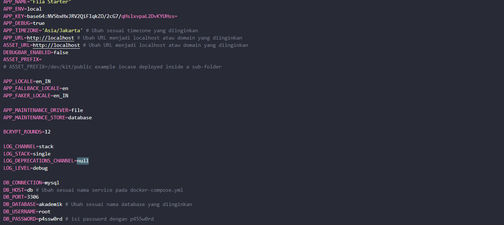
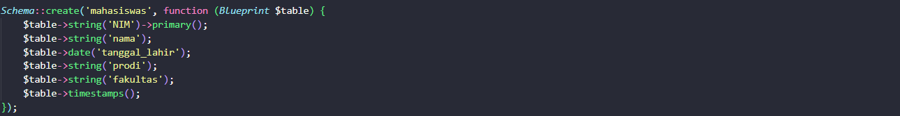
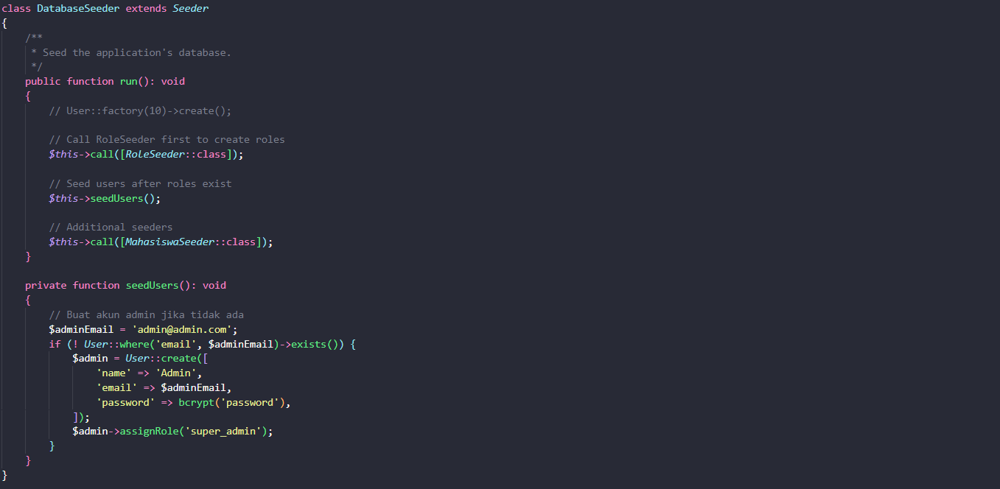
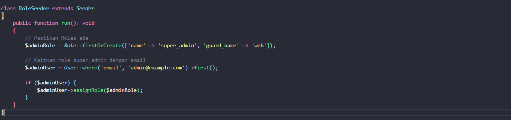
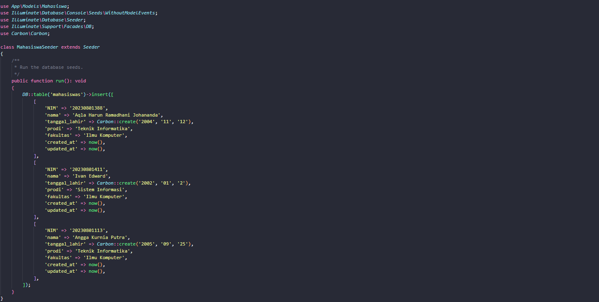
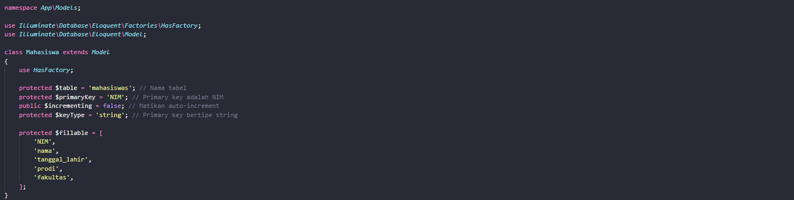

# 🚀 Panduan Setup **SampleApp**

Panduan ini akan memandu Kalian dalam mengonfigurasi **SampleApp** menggunakan Docker, termasuk pengaturan dependency, konfigurasi lingkungan, dan pembuatan model. Ikuti langkah-langkah di bawah ini untuk memudahkan proses setup.

## ⚙️ Persiapan Awal

1. **Ekstrak File Proyek**  
   ```bash
   unzip sampleapp.zip
   ```

   ```bash
   cd sampleapp
   ```

2. **Jalankan Docker**
   
   Buka Docker terlebih dahulu untuk memulai, lalu jalankan perintah berikut:

   ```bash
   docker compose up -d
   ```

3. **Masuk ke dalam Container**
   ```bash
   docker exec -it sample bash
   ```

4. **Buat Proyek dengan Composer**
   ```bash
   composer create-project --prefer-dist raugadh/fila-starter .
   ```

---

## 🔧 Konfigurasi Lingkungan
1. **Edit File `.env`**
   
   Sesuaikan konfigurasi di file `.env` sesuai kebutuhan proyek kalian di `src/.env`.
   

2. **Generate Kunci Aplikasi**
   ```bash
   php artisan key:generate
   ```

3. **Buat Link Storage**
   ```bash
   php artisan storage:link
   ```

4. **Jalankan Migrasi Database**
   ```bash
   php artisan migrate
   ```

5. **Atur Izin Akses**
   ```bash
   chown -R www-data:www-data storage/*
   chown -R www-data:www-data bootstrap/*
   ```

6. **Inisialisasi Proyek**
   ```bash
   php artisan project:init
   ```

## 🧩 Pembuatan dan Konfigurasi Model

1. **Buat Model `Mahasiswa`**  
   
   Gunakan flag `-ms` untuk secara otomatis membuat migration dan seeder:

   ```bash
   php artisan make:model Mahasiswa -ms
   ```

2. **Sesuaikan Migration**
   
   Buka file migration yang dihasilkan di dalam folder `database/migrations/2024_12_13_193044_create_mahasiswas_table.php` dan sesuaikan skema sesuai kebutuhan proyek.
   

3. **Sesuaikan Seeder**
   
   Sesuaikan seeder pada file src/database/seeders untuk menambahkan data awal pada tabel yang diperlukan.

   - DatabaseSeeder
   

   - RoleSeeder
   

   - MahasiswaSeeder
   


4. **Sesuaikan Model**
   
   Edit model Schedules di dalam folder src/app/Models sesuai dengan kebutuhan analisis Anda.
   - Mahasiswa
   

---

## 🎉 Langkah Terakhir

1. **Generate Filament Resource**
   ```bash
   php artisan make:filament-resource Mahasiswa --generate
   ```

2. **Jalankan Migrasi**
   ```bash
   php artisan migrate
   ```

3. **Inisialisasi Ulang Proyek**
   ```bash
   php artisan project:init
   ```

---

## Yuhuu kelar 🎉